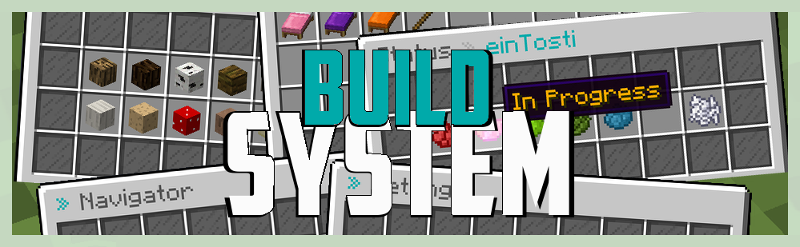

# BuildSystem

Welcome to my site all about my plugin, **BuildSystem**.

**BuildSystem** is a simple but powerful - as the name already says - system for builders, with lots of great features for everyday usage.\
Manage worlds in the worlds navigator, change their permission, projects, and status with ease.\
And not to forget: let each player decide which settings they think are best for them and now the building can start!

It was first released on **September 9, 2018** on _SpigotMC.org_. Since then, I have invested **hundreds of hours** into its programming and have released **over 100 updates.** \
Despite the fact that I've since started studying and working, I'm aiming to keep on publishing more in the future!

If you are a **new** user, I suggest you read the following in order to learn the basics of the plugin:


[installing-buildsystem.md](getting-started/installing-buildsystem.md)


