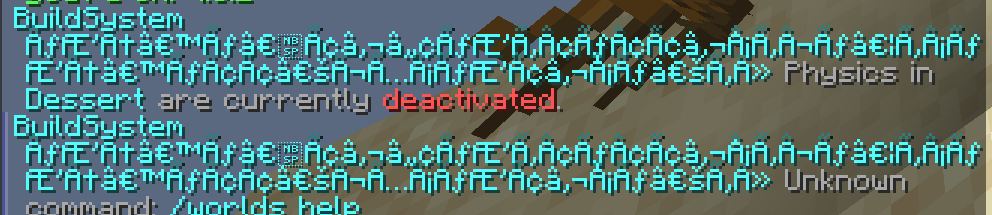

# Common Issues

## Issue 1 - Manipulating world

> "I can(not) build, even though I should be able to"


Not every player can always interact with the world they are in.


Reasons an interaction could be cancelled:

* The world has its **Status** (see [`/worlds setStatus`](../commands/worlds/setstatus.md#usage)) set to archived
* The world has a setting enabled (see [`/worlds edit`](../commands/worlds/edit.md#usage)) which disallows certain events
* The world only allows **Builders** to build and the player is not such a builder

However, a player can override these reasons if:

* The player has the permission `buildsystem.admin`
* The player has the permission `buildsystem.bypass.archive`
* The player has used [`/build`](../commands/build.md#usage) to enter build-mode

## Issue 2 - Weird symbols appearing in messages

If ever start the server and see weird symbols in your messages instead of a UTF-8 character, try adding the following to your startup script:

```
-Dfile.encoding=UTF-8
```



