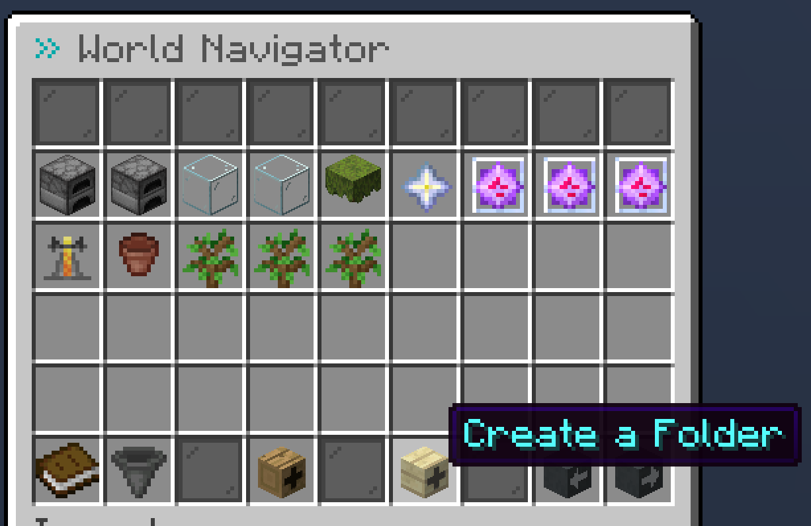
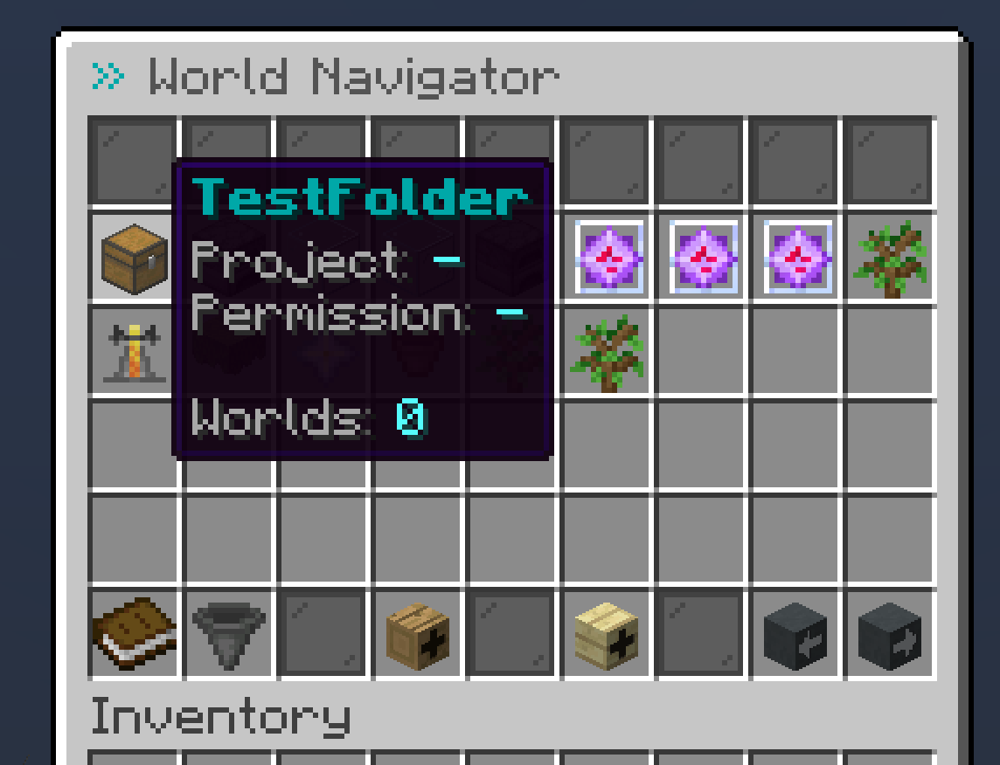

# Creating a Folder

## Creating a new folder

Before stating, make sure you have the permission `buildsystem.create.folder`. Then, to create a folder, head to the navigator and click the birch wood skull:

<figure><figcaption>
Button for creating a folder
</figcaption></figure>

***

Then you will be prompted to enter a folder name into the chat (similarly to when creating a world):

<figure><figcaption>
Prompt for entering folder name
</figcaption></figure>

***

Easy as that. The folder has now been added to the category (public/private/archive) in which the button was clicked

<figure><figcaption>
The newly created folder
</figcaption></figure>

## Managing a folder

There are now a few commands which can be performed by players that have the necessary permissions:

### Adding worlds to a folder


A world can only be in one folder at a time.


* Command: `/worlds folder <folder> add <world>`
* Permission: `buildsystem.folder.add`

When a world is in a folder, it will inherit the folder's **permission** and **project** as long as the config options (`folder.override-permissions` and `folder.override-projects` respectively) are enabled.

### Removing worlds from a folder

* Command: `/worlds folder <folder> remove <world>`
* Permission: `buildsystem.folder.remove`

When a world is removed from a folder, it will regain its previous permission and project.

### Deleting a folder


A folder can only be deleted after all contained worlds & subfolders have been removed.


* Command: `/worlds folder <folder> delete`
* Permission: `buildsystem.folder.delete`

### Other commands

#### **Setting a folder's permission**

* Command: `/worlds folder <folder> setPermission`
* Permission: `buildsystem.folder.setpermission`

#### **Setting a folder's project**

* Command: `/worlds folder <folder> setProject`
* Permission: `buildsystem.folder.setproject`

#### **Setting a folder's navigator icon**

* Command: `/worlds folder <folder> setItem`
* Permission: `buildsystem.folder.setitem`
