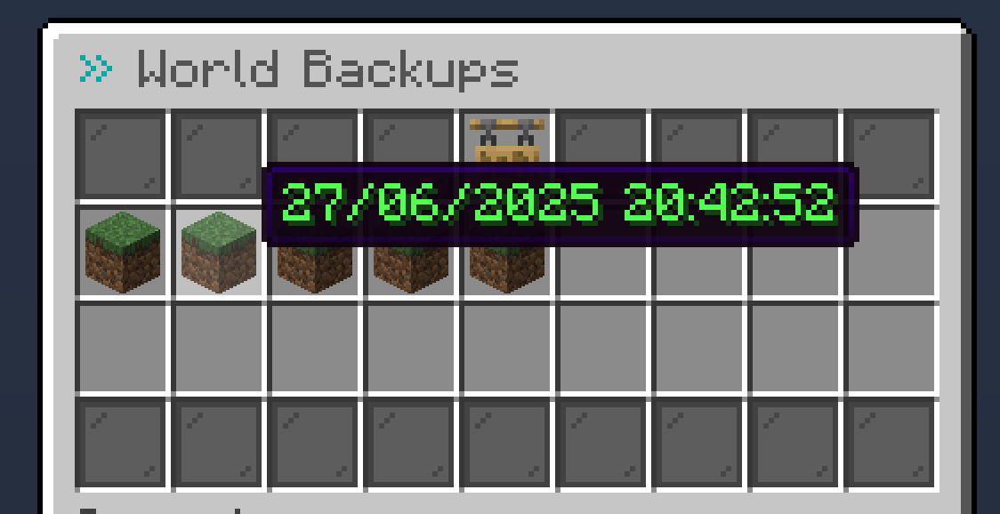
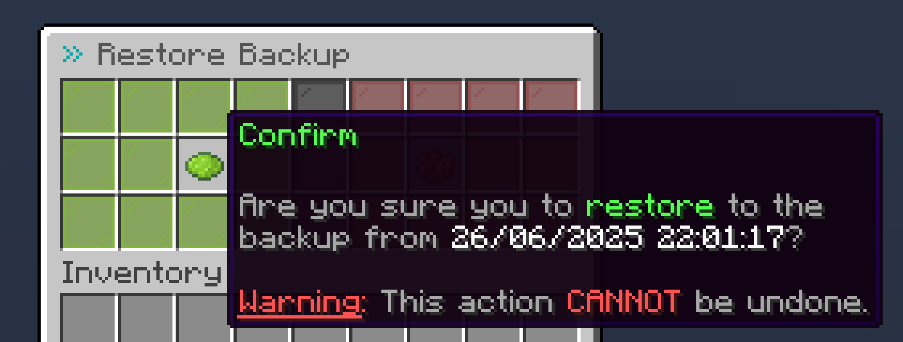

# World Backups

## Getting started

Before creating any backups, ensure that the [`backups`](config.md#backup) section in the `config.yml` file is properly configured.

## Creating a backup

### Automatically

When enabled in the config, backups are automatically created in the defined interval.\
If `backup.auto-backup.only-active-worlds` is set to `true`, the time until a backup will be only created is only incremented as long as a builder (i.e. player who can modify the world) is present in the world.

### Manually

Players with the permission `buildsystem.backup.create` can manually create a backup of the world they are in using `/worlds backup create`.

## Viewing backups

Creators of a world (or players with the `buildsystem.admin` bypass permission) can view the backups of the world they are in using `/worlds backup`. Additionally, they will need the permission: `buildsystem.backup`.

<figure><figcaption></figcaption></figure>

Each backup item's name will have the date and time at which it is was created.

## Restoring a backup


Restoring a backup of the server's main world (often `world`) can lead to issues and is not advised. If you decide to do so, make sure to restart the server immediately after.


To restore a world to a backup, simply click on the desired backup within the backups overview. You will then be prompted to confirm the action since it cannot be reverted.

<figure><figcaption></figcaption></figure>
